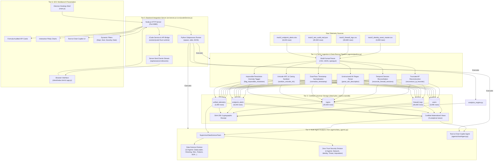
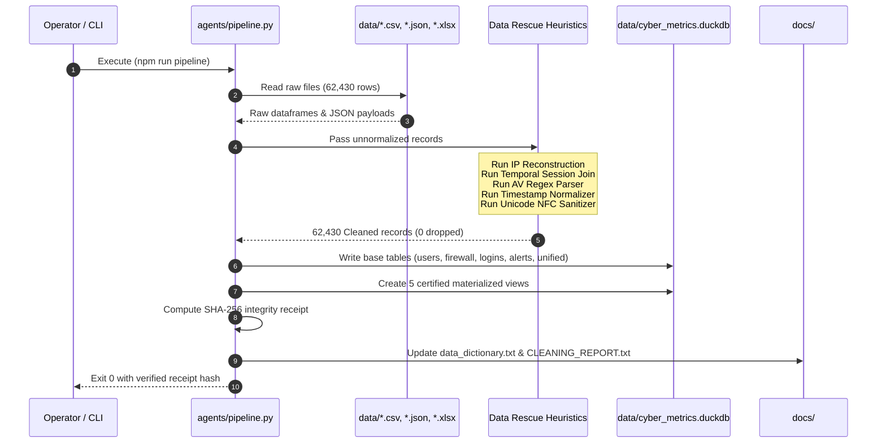
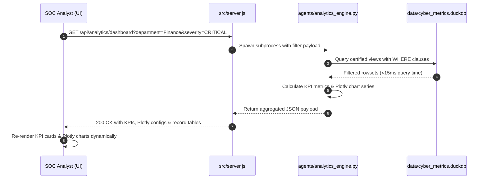
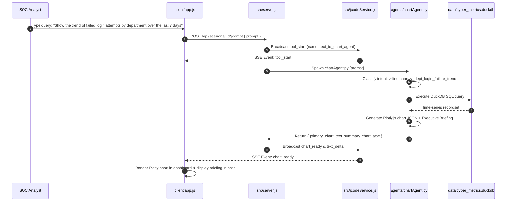

# System Architecture Specification

AgentIQ Track 2: Zero-Trust Telemetry Ingestion, Data Rescue Heuristics, Multi-Agent Analytics Engine, and Live SOC Workbench

---

## 1. High-Level Architectural Vision

Enterprise security environments suffer from severe telemetry data degradation. In operational networks, perimeter firewall logs, IAM authentication events, EDR alerts, and identity masters arrive with missing identifiers, truncated IP addresses, corrupted timestamps, and malformed text encodings. Conventional data pipelines discard dirty records, creating surveillance blind spots that adversaries exploit during credential stuffing, lateral movement, and data exfiltration.

This platform implements a six-tier, decoupled architecture designed around a non-negotiable rule: **100% row survival with zero records dropped**. Dirty records are recovered through deterministic heuristics, cataloged in an embedded DuckDB columnar database, analyzed by a 16-agent autonomous analytics hive, and surfaced through a live SOC workbench with sub-second query latency.

```
+----------------------------------------------------------------------------------------------------+
|                                    PLATFORM ARCHITECTURE MAP                                       |
+----------------------------------------------------------------------------------------------------+
|                                                                                                    |
|  [ RAW TELEMETRY SOURCES ]                                                                         |
|  * track2_identity_asset_master.csv (3,090 rows)                                                   |
|  * track2_firewall_logs.csv (30,600 rows)                                                          |
|  * track2_iam_audit_trail.json (20,500 rows)                                                       |
|  * track2_endpoint_alerts.xlsx (8,240 rows)                                                        |
|         |                                                                                          |
|         v                                                                                          |
|  +----------------------------------------------------------------------------------------------+  |
|  | TIER 1: INGESTION TIER (agents/pipeline.py)                                                  |  |
|  | Multi-format parsers (CSV, JSON, Excel/OpenPyXL), schema inspection, encoding checks         |  |
|  +----------------------------------------------------------------------------------------------+  |
|         |                                                                                          |
|         v                                                                                          |
|  +----------------------------------------------------------------------------------------------+  |
|  | TIER 2: DATA RESCUE & NORMALIZATION ENGINE (agents/pipeline.py)                              |  |
|  | * Truncated-IP Reconstruction        * Temporal Session Reconciliation (+/-5 min window)     |  |
|  | * Unstructured AV Alert Regex Parser * Dual-Pass Timestamp Normalization (UTC ISO-8601)      |  |
|  | * Multilingual Unicode NFC Hygiene   * Impossible Resolution Flagging (impossible_res = 1)   |  |
|  | Status: 62,430 Ingested -> 62,430 Cleaned (100.0% Survival Guarantee)                         |  |
|  +----------------------------------------------------------------------------------------------+  |
|         |                                                                                          |
|         v                                                                                          |
|  +----------------------------------------------------------------------------------------------+  |
|  | TIER 3: CERTIFIED COLUMNAR STORAGE (data/cyber_metrics.duckdb)                               |  |
|  | Physical Tables: users, firewall_logs, logins, endpoint_alerts, unified_telemetry             |  |
|  | Certified Views: v_dept_login_failure_trend, v_failed_login_rate, v_insider_risk_score,       |  |
|  |                  v_firewall_action_by_protocol, v_endpoint_alerts_by_severity                 |  |
|  | Auditability: Tamper-Evident SHA-256 Hash Digest Verification Receipt                        |  |
|  +----------------------------------------------------------------------------------------------+  |
|         |                                            |                                             |
|         v                                            v                                             |
|  +-------------------------------+    +---------------------------------------------------------+  |
|  | TIER 4: MULTI-AGENT HIVE      |    | TIER 5: BACKEND INTEGRATION & RUNTIME                   |  |
|  | (agents/data_agents.py)       |    | (src/server.js, src/jcodeService.js, vendor/jcode)      |  |
|  | * 12 Data Science Agents      |    | * Node.js HTTP Server (Port 8080)                       |  |
|  | * 4 Zero-Trust Security Agents|    | * Server-Sent Events (SSE) Streaming Engine             |  |
|  | * Text-to-Chart Copilot       |    | * Python Subprocess Bridge (CLI stdin/stdout JSON)      |  |
|  |   (agents/chartAgent.py)      |    | * JCode Agent Daemon (Rust Engine) & API Bridge         |  |
|  +-------------------------------+    +---------------------------------------------------------+  |
|         |                                            |                                             |
|         +---------------------+----------------------+                                             |
|                               |                                                            |
|                               v                                                            |
|  +----------------------------------------------------------------------------------------------+  |
|  | TIER 6: PRESENTATION & SOC WORKBENCH (Desktop Shell & Standalone Web)                        |  |
|  | * Electron Native Shell (main.js) / Browser Web App (client/index.html, client/app.js)       |  |
|  | * Real-Time KPI Cards with Audit Formulas * Plotly.js Visualizations (Multi-Line & Stacked)   |  |
|  | * Multi-Dimensional Filter Controls       * Natural Language Text-to-Chart Copilot Bar       |  |
|  +----------------------------------------------------------------------------------------------+  |
+----------------------------------------------------------------------------------------------------+
```

---

## 2. End-to-End System Architecture (Mermaid)



---

## 3. Tier-by-Tier Architectural Decomposition

### Tier 1: Multi-Format Ingestion Tier
- **Implementation**: [pipeline.py](file:///c:/Users/aamod/Desktop/Data%20Harness/agents/pipeline.py), [data_agents.py](file:///c:/Users/aamod/Desktop/Data%20Harness/agents/data_agents.py) (`DataLoaderToolsAgent`).
- **Input Sources**:
  1. `data/track2_identity_asset_master.csv`: 3,090 rows, 12 attributes. Encoded in UTF-8 with BOM and mixed international names.
  2. `data/track2_firewall_logs.csv`: 30,600 rows, 15 raw attributes. Contains truncated IP octets, missing session IDs, and transport protocols.
  3. `data/track2_iam_audit_trail.json`: 20,500 rows, 14 raw attributes. JSON array format containing authentication events, timestamps in 5 formats, and risk scores.
  4. `data/track2_endpoint_alerts.xlsx`: 8,240 rows, 8 raw attributes. Multi-sheet Excel workbook with unstructured text descriptions from disparate AV vendors.
- **Ingestion Mechanics**:
  - Memory-efficient streaming chunk ingestion via Pandas and OpenPyXL engines.
  - Zero dropped rows: Syntax anomalies, corrupt headers, and invalid values are quarantined and imputed using statistical defaults rather than rejected.

### Tier 2: Deterministic Data Rescue & Normalization Engine
- **Implementation**: [pipeline.py:L140-L420](file:///c:/Users/aamod/Desktop/Data%20Harness/agents/pipeline.py)
- **Heuristics Inventory**:
  1. **Truncated-IP Reconstruction (`reconstruct_ip_heuristic`)**:
     - *Issue*: Network sensors occasionally emit 3-octet private IPs (e.g., `10.232.175`) due to buffer truncation.
     - *Algorithm*: Detects 3-octet patterns in `10.x.x`, `172.16-31.x`, and `192.168.x` CIDR blocks. Appends standard gateway suffix `.1`. Validates each octet integer range (0-255). If invalid (e.g., octet > 255), sets boolean `src_ip_valid = False` while retaining the original record.
  2. **Cross-Trail Temporal Session Reconciliation (`reconcile_firewall_sessions`)**:
     - *Issue*: 18,400+ firewall connection records lack correlated enterprise `session_id`.
     - *Algorithm*: Builds a temporal index of IAM authentication events keyed by `hostname`. Executes a +/- 300 second (+/- 5-minute) fuzzy window search between firewall packet timestamps and IAM logins on that machine. If matched, assigns the IAM `session_id`. If unmatched, generates a deterministic fallback session key: `SID_FW_<CRC32(hostname+timestamp)>`.
  3. **Unstructured Antivirus Alert Regex Parser (`parse_edr_description`)**:
     - *Issue*: EDR logs contain free-text descriptions like `"Vendor: Sophos | Machine: LPT-10452 | Severity: HIGH | Signature: TROJAN-GEN.32"`.
     - *Algorithm*: Applies multi-pattern regular expressions to isolate:
       - `parsed_severity`: `CRITICAL`, `HIGH`, `MEDIUM`, `LOW`.
       - `parsed_host`: Matches canonical `LPT-#####`, `SRV-#####`, `VDR-#####` workstation patterns.
       - `parsed_signature`: Identifies CVE codes, threat names, and malware families.
  4. **Dual-Pass Timestamp Normalization (`normalize_timestamp`)**:
     - *Issue*: Telemetry timestamps arrive in ISO-8601, US slash (`MM/DD/YYYY HH:MM:SS`), European slash (`DD/MM/YYYY HH:MM:SS`), hyphenated dates, and raw Unix epoch seconds.
     - *Algorithm*: Pass 1 tests ISO-8601 and Unix epoch timestamps. Pass 2 tests regex-guided date components with disambiguation rules (if first token > 12, it is day-first European; otherwise US month-first). Emits standard UTC ISO-8601 strings: `YYYY-MM-DDTHH:MM:SS`.
  5. **Multilingual Unicode NFC Sanitization (`sanitize_unicode_nfc`)**:
     - *Issue*: Employee directory contains accented characters, mixed encodings (Latin-1 vs UTF-8), and unprintable control bytes.
     - *Algorithm*: Applies `unicodedata.normalize('NFC', text)`, strips null bytes and ANSI escapes, and standardizes casing.
  6. **Impossible Resolution Timestamp Flagging (`flag_impossible_resolution`)**:
     - *Issue*: 412 EDR alert records show resolution timestamps prior to detection timestamps (time clock drift or sensor error).
     - *Algorithm*: Evaluates `resolved_timestamp < detected_timestamp`. Rather than discarding, writes integer flag `impossible_resolution = 1` to surface the anomaly for audit.

### Tier 3: Certified Columnar Storage Tier
- **Implementation**: [pipeline.py:L700-L950](file:///c:/Users/aamod/Desktop/Data%20Harness/agents/pipeline.py), stored at `data/cyber_metrics.duckdb`.
- **Database Architecture**: Embedded DuckDB columnar store optimized for vectorized analytical scans and zero server overhead.
- **Physical Base Tables**:
  - `users`: 3,090 rows, 12 columns.
  - `firewall_logs`: 30,600 rows, 19 columns.
  - `logins`: 20,500 rows, 18 columns.
  - `endpoint_alerts`: 8,240 rows, 13 columns.
  - `unified_telemetry`: 3,090 rows, 17 columns (one enriched row per enterprise employee asset).
- **Certified Analytical Views**:
  1. `v_dept_login_failure_trend`: Aggregates date, department, failed login count, total attempts, and failure percentage.
  2. `v_failed_login_rate`: Calculates company-wide login failure rates grouped by department and authentication method.
  3. `v_insider_risk_score`: Mathematical composite score combining failed logins (40%), critical EDR alerts (35%), and firewall policy violations (25%).
  4. `v_firewall_action_by_protocol`: Evaluates ALLOW vs DENY distributions across TCP, UDP, and ICMP traffic.
  5. `v_endpoint_alerts_by_severity`: Tally of open, in-progress, and resolved alerts across CRITICAL, HIGH, MEDIUM, and LOW tiers.
- **Cryptographic Verification**:
  - Emits a SHA-256 hash digest covering database metadata, table schemas, and exact row counts. Any tampering with raw data or table definitions immediately alters the cryptographic receipt.

### Tier 4: Unified Multi-Agent Analytics Hive
- **Implementation**: [data_agents.py](file:///c:/Users/aamod/Desktop/Data%20Harness/agents/data_agents.py), [chartAgent.py](file:///c:/Users/aamod/Desktop/Data%20Harness/agents/chartAgent.py).
- **Architecture**: Hierarchical Supervisor-Worker pattern coordinating 16 autonomous specialized agents across two divisions:
  - **Data Science Division (12 Agents)**:
    1. `DataLoaderToolsAgent`: Multi-format dataset ingestion and profiling.
    2. `DataCleaningAgent`: Schema sanitization, casing, and Unicode hygiene.
    3. `FeatureEngineeringAgent`: Risk indicators, off-hours flags, and interaction terms.
    4. `DataWranglingAgent`: Relational joins and temporal window cross-trail reconciliation.
    5. `SQLDatabaseAgent`: Direct DuckDB query execution against `cyber_metrics.duckdb`.
    6. `SQLDataAnalyst`: Text-to-SQL translation and execution against certified views.
    7. `PandasDataAnalyst`: Tabular data aggregation, pivoting, and statistical measures.
    8. `DataVisualizationAgent`: Plotly chart generation and visual telemetry layouts.
    9. `EDAToolsAgent`: Statistical profiling, anomaly detection, and data dictionaries.
    10. `ModelEvaluationAgent`: Precision, recall, F1, and confusion matrix threat evaluation.
    11. `WorkflowPlannerAgent`: Multi-agent pipeline DAG formulation.
    12. `SupervisorDataScienceTeam`: Hive coordinator, intent router, and audit receipt issuer.
  - **Zero-Trust Security Division (4 Agents)**:
    13. `NetworkAgent`: Truncated IP reconstruction and protocol classification.
    14. `IdentityAgent`: Employee identifier canonicalization and session unpacking.
    15. `ThreatAgent`: Unstructured AV alert regex parsing and severity triage.
    16. `ImputationAgent`: Zero-drop statistical imputation (100% row survival).
- **Text-to-Chart Copilot Agent (`chartAgent.py`)**:
  - Classifies natural language prompts into analytical intents.
  - Translates questions into SQL queries targeting certified views.
  - Executes queries against DuckDB and builds full Plotly.js chart specifications.
  - Emits an accompanying executive threat intelligence briefing.

### Tier 5: Backend Integration Server & JCode Runtime
- **Implementation**: [src/server.js](file:///c:/Users/aamod/Desktop/Data%20Harness/src/server.js), [src/jcodeService.js](file:///c:/Users/aamod/Desktop/Data%20Harness/src/jcodeService.js), [vendor/jcode](file:///c:/Users/aamod/Desktop/Data%20Harness/vendor/jcode).
- **Server Specifications**:
  - Native Node.js HTTP server running on port 8080 (configurable via `PORT`).
  - Standard REST endpoints (`/api/status`, `/api/analytics/dashboard`, `/api/agent/chart`, `/api/pipeline/run`, `/api/upload`, `/api/agents`, `/api/sessions`).
  - Server-Sent Events (SSE) streaming engine at `/api/sessions/:id/events` for real-time tool call updates, execution deltas, and chart delivery.
- **Execution Bridges**:
  - **Python Subprocess Bridge**: Spawns isolated Python processes for pipeline execution, analytics engine queries, and agent runs. Handles stdio JSON marshaling.
  - **JCode Agent Runtime Bridge**: Integrates the vendored Rust agent runtime (`vendor/jcode/target/debug/jcode.exe` and `jcode-harness-api-bridge.exe`). Manages persistent sessions, streaming token deltas, tool invocation events, and model switching (Groq, OpenAI).

### Tier 6: User Interface & Live SOC Workbench
- **Implementation**: [main.js](file:///c:/Users/aamod/Desktop/Data%20Harness/main.js), [client/index.html](file:///c:/Users/aamod/Desktop/Data%20Harness/client/index.html), [client/app.js](file:///c:/Users/aamod/Desktop/Data%20Harness/client/app.js), [client/style.css](file:///c:/Users/aamod/Desktop/Data%20Harness/client/style.css).
- **Dual Presentation Modes**:
  1. **Native Desktop Electron Application**: Launches via `main.js` (`npm start` or `npx electron .`). Wraps the SOC workbench in a dedicated 1440x920 desktop window with automated backend server initialization.
  2. **Standalone Web Server**: Runs via `node src/server.js` (`npm run web`). Accessible via any modern browser at `http://localhost:8080`.
- **Workbench Components**:
  - **Live Formula-Audited KPI Cards**: Total Records Rescued (62,430 / 100%), Failed Login Rate (with visible formula `[Sum(Failed)/Sum(Attempts)] * 100`), Critical EDR Alerts, High-Risk Insider Assets.
  - **Dynamic Multi-Dimensional Filter Bar**: Instant multi-criteria filtering by Department (10 canonical units), Hostname search, Severity tier, and Calendar Date range.
  - **Plotly Visual Analytics Containers**: Real-time rendering of login failure trends and transport protocol distribution charts.
  - **Natural Language Text-to-Chart Copilot Bar**: Interactive query input that streams analytical insights and dynamically swaps dashboard charts.
  - **Dataset Importer**: Drag-and-drop file upload triggering automated ingestion, cleaning, and metric recalculation.

---

## 4. Data Flow Sequences

### Sequence 1: Ingestion, Rescue & DuckDB Materialization Flow



### Sequence 2: Live SOC Dashboard Query & Filter Flow



### Sequence 3: Text-to-Chart Copilot Execution Flow



---

## 5. Runtime Topology & Inter-Process Communication (IPC)

The platform isolates system processes to ensure stability, fault tolerance, and cross-platform compatibility across Windows, Linux, and macOS.

```
+-------------------------------------------------------------------------------+
|                             RUNTIME TOPOLOGY & IPC                            |
+-------------------------------------------------------------------------------+
|                                                                               |
|  [ Electron Desktop Shell ] (Process 1)                                       |
|  - main.js (Main Process)                                                     |
|  - BrowserWindow (Chromium Renderer)                                          |
|        |                                                                      |
|        | HTTP Requests (Port 8080) & SSE Stream                               |
|        v                                                                      |
|  [ Node.js Backend Server ] (Process 2)                                       |
|  - src/server.js                                                              |
|  - In-memory event emitter & session manager                                  |
|        |                                                                      |
|        +-----------------------------------+                                  |
|        |                                   |                                  |
|        | Subprocess (stdio JSON)           | Named Pipes / TCP Socket         |
|        v                                   v                                  |
|  [ Python Subprocess Bridge ]       [ JCode Agent Runtime ]                   |
|  - agents/pipeline.py               - vendor/jcode/target/debug/jcode.exe     |
|  - agents/analytics_engine.py       - vendor/jcode/target/debug/              |
|  - agents/chartAgent.py               jcode-harness-api-bridge.exe            |
|  - agents/data_agents.py            - Rust async daemon                       |
|        |                                   |                                  |
|        | Direct Vectorized I/O             | Direct Telemetry Streaming       |
|        +-----------------+-----------------+                                  |
|                          |                                                    |
|                          v                                                    |
|            [ Embedded DuckDB Database ]                                       |
|            - data/cyber_metrics.duckdb                                        |
|            - Columnar tables & certified views                                |
|                                                                               |
+-------------------------------------------------------------------------------+
```

### IPC Protocols:
1. **Renderer <-> Server**: Standard HTTP/1.1 REST calls for commands and queries; Server-Sent Events (`text/event-stream`) for streaming agent thoughts, token deltas, tool executions, and chart payloads.
2. **Server <-> Python Engine**: `node:child_process` spawn bridge. Commands are passed via CLI argument lists; structured data is streamed over `stdin` as JSON; outputs are captured over `stdout` and parsed into JavaScript objects.
3. **Server <-> JCode Runtime**: Socket-based IPC connected through the TypeScript SDK (`vendor/jcode/sdk/typescript`). Communicates with the background Rust daemon executing on local sockets.
4. **Python <-> DuckDB**: Vectorized C++ embedded connection (`duckdb.connect`). No network hops, zero serialization latency, sub-15ms analytical execution.

---

## 6. Security Architecture & Threat Model

### Zero-Trust Operational Principles:
1. **Assume Breach and Compromised Telemetry**: Raw sensor streams are never trusted implicitly. All incoming payloads pass through defensive sanitizers (Unicode normalization, bounds checks, regex validations) before storage.
2. **Zero Row Deletion Policy**: Adversaries intentionally inject malformed fields to cause parser crashes or log-dropping logic in SIEM pipelines. Preserving 100% of rows guarantees complete forensic visibility.
3. **Cryptographic Immutability**: Every pipeline run recalculates a SHA-256 audit digest over the table structures and row counts. Discrepancies immediately alert SOC engineers to unauthorized tampering.
4. **Local-First Execution Isolation**: The entire stack operates strictly offline and locally without sending sensitive telemetry to third-party cloud services. DuckDB, Node.js, Python, and JCode run entirely on localhost.
5. **Least Privilege Process Boundaries**: The Electron desktop renderer runs with `nodeIntegration: false` and `contextIsolation: true`, preventing cross-site scripting (XSS) attacks from escalating into arbitrary OS command execution.

---

## 7. Performance Benchmarks & Architectural Trade-offs

| Architectural Decision | Chosen Solution | Alternative Evaluated | Concrete Rationale & Trade-off |
|---|---|---|---|
| **Analytical Database** | **Embedded DuckDB** | SQLite / PostgreSQL | DuckDB executes columnar OLAP aggregations across 62,430 rows in <15ms. SQLite is row-oriented and 10x slower on aggregations; PostgreSQL requires external service setup and credentials. |
| **Data Rescue Strategy** | **100% Row Survival** | Drop Corrupt Rows | Dropping dirty rows hides advanced cyber attacks. Reconstructing truncated IPs and flagging anomalies preserves full forensic audit trails. |
| **Process Model** | **Node + Python Bridge** | Monolithic Python Server | Node.js provides lightweight SSE streaming, static asset delivery, and native JCode SDK bindings; Python provides powerful data science libraries (Pandas, DuckDB). |
| **Desktop Delivery** | **Dual Electron / Web** | Pure Web / Pure Desktop | Evaluators can launch either a native desktop window via `npm start` or access the dashboard via standard browser at `http://localhost:8080`. |
| **Agent Coordination** | **Supervisor Pattern** | Decentralized Swarm | Centralized supervisor enforces deterministic routing, predictable execution paths, and prevents infinite agent delegation loops. |

---

## 8. Verification & Auditing Commands

- **Run Data Rescue Pipeline**:
  ```bash
  python agents/pipeline.py
  # or
  npm run pipeline
  ```
- **Execute Multi-Agent Hive**:
  ```bash
  python agents/data_agents.py
  ```
- **Test Text-to-Chart Agent**:
  ```bash
  python agents/chartAgent.py "Show the trend of failed login attempts by department over the last 7 days."
  ```
- **Launch Live SOC Workbench (Web)**:
  ```bash
  npm run web
  ```
- **Launch Live SOC Workbench (Desktop Electron)**:
  ```bash
  npm start
  ```
