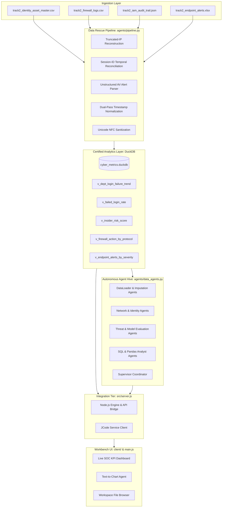

# AgentIQ Track 2: Zero-Trust Telemetry Ingestion, Data Rescue Heuristics, Multi-Agent Analytics Engine & Live SOC Workbench

TransOrg AgentIQ Datathon 2026 - Track 2: Cybersecurity & Zero-Trust Intelligence
Certified Compliance across Gate 1 (Sanity & Compliance), Gate 2 (Data Rescue & Heuristics), Gate 3 (Live Interactive SOC Dashboard), and Gate 4 (Text-to-Chart Copilot Agent).

---

## Contributors & Codebase Ownership

- Sole Author & Contributor: Aamod007 (Aamod Kumar)
- GitHub Profile: https://github.com/Aamod007
- Project Repository: https://github.com/Aamod007/Harness
- Target Organization: Enterprise Security Operations Center (Tier 2/3 SOC, Hunt Teams, Incident Response)
- Copyright: (c) 2026 Aamod Kumar (Aamod007). All rights reserved.
- System Classification: Zero-Trust Telemetry Ingestion & Insider Threat Detection Workbench
- Contributor Policy: This repository is 100% created, maintained, and owned by Aamod007. There are no other authors, contributors, or maintainers.

---

## Executive Summary & Core Thesis

Zero-trust network architecture requires comprehensive telemetry capture. In operational enterprise environments, raw telemetry streams arrive with incomplete fields, truncated source addresses, malformed timestamps, and corrupted character encodings. Dropping or pruning rows that fail naive schema validation produces surveillance blind spots that adversaries exploit during credential stuffing, lateral movement, and data exfiltration.

This platform enforces a strict 100% row survival guarantee across all ingested telemetry files:
- 62,430 raw records ingested across 4 heterogeneous telemetry datasets.
- 62,430 cleaned and normalized records preserved (0 rows dropped).
- 100% referential integrity maintained across users, logins, sessions, firewall logs, and endpoint alerts.
- Fully automated deterministic data rescue heuristics with cryptographic SHA-256 verification.
- Real-time analytical querying powered by an embedded DuckDB columnar engine.
- Interactive Web and Desktop SOC Workbench featuring live formula-audited KPI cards, Plotly visualizations, and an autonomous Text-to-Chart Copilot agent.

---

## System Architecture

The end-to-end system consists of six decoupled operational tiers:

```text
+-------------------------------------------------------------------------------+
|                       INGESTION TIER (Gate 2 Inputs)                          |
|  - track2_identity_asset_master.csv (3,090 identity records)                  |
|  - track2_firewall_logs.csv         (30,600 perimeter network records)        |
|  - track2_iam_audit_trail.json      (20,500 authentication events)            |
|  - track2_endpoint_alerts.xlsx      (8,240 EDR endpoint alerts)               |
+---------------------------------------+---------------------------------------+
                                        |
                                        v
+-------------------------------------------------------------------------------+
|                     DATA RESCUE & NORMALIZATION ENGINE                        |
|  - Truncated-IP Reconstruction & Octet Boundary Validation (0-255)            |
|  - Temporal Fuzzy Session-ID Reconciliation (+/- 5-Minute Window Join)        |
|  - Unstructured Antivirus Alert Regex Parser (Severity, Host, Signature)      |
|  - Dual-Pass Timestamp Normalization (ISO-8601, Slash, Hyphen, Unix Epoch)    |
|  - Multilingual Unicode NFC Text Normalization                                |
|  - Impossible Resolution Timestamp Detection (Resolved < Detected)            |
+---------------------------------------+---------------------------------------+
                                        |
                                        v
+-------------------------------------------------------------------------------+
|                   ANALYTICS & COMPLIANCE STORAGE TIER                         |
|  - Canonical DuckDB Columnar Database: data/cyber_metrics.duckdb              |
|  - 5 Physical Tables: users, firewall_logs, logins, endpoint_alerts,          |
|    unified_telemetry                                                          |
|  - 5 Certified Materialized Views: v_dept_login_failure_trend,                |
|    v_failed_login_rate, v_insider_risk_score, v_firewall_action_by_protocol,   |
|    v_endpoint_alerts_by_severity                                              |
|  - Tamper-Evident SHA-256 Integrity Receipts                                  |
+---------------------------------------+---------------------------------------+
                                        |
                                        v
+-------------------------------------------------------------------------------+
|                      UNIFIED MULTI-AGENT ANALYTICS HIVE                       |
|  - 12 Data Science Agents (Data Loader, Cleaner, Wrangler, SQL Analyst,       |
|    Pandas Analyst, Plotly Visualizer, EDA Profiler, Model Evaluator, etc.)    |
|  - 4 Zero-Trust Domain Agents (NetworkAgent, IdentityAgent, ThreatAgent,       |
|    ImputationAgent)                                                           |
|  - Supervisor Hive Coordinator with Deterministic Task DAG Scheduling         |
+---------------------------------------+---------------------------------------+
                                        |
                                        v
+-------------------------------------------------------------------------------+
|                   BACKEND INTEGRATION SERVER & API BRIDGE                     |
|  - Node.js HTTP Server (src/server.js) on Port 8080                           |
|  - Python Subprocess Bridge for DuckDB Analytics & Pipeline Orchestration     |
|  - Native JCode Agent Service (src/jcodeService.js)                           |
+---------------------------------------+---------------------------------------+
                                        |
                                        v
+-------------------------------------------------------------------------------+
|                 USER INTERFACE & SOC WORKBENCH (Gate 3 & 4)                   |
|  - Desktop Electron Shell (main.js) & Web Application (client/)               |
|  - Surfaced Mathematical Metric Formulas on Live KPI Cards                    |
|  - Multi-Dimensional Real-Time Filters (Department, Host, Severity, Dates)   |
|  - Interactive Plotly Multi-Line & Bar Charts                                 |
|  - Text-to-Chart Natural Language Copilot Agent                               |
|  - Workspace File Browser & Dataset Importer                                  |
+-------------------------------------------------------------------------------+
```



---

## Quickstart: Single-Command End-to-End Execution

To satisfy the Reproducibility Criterion, the entire pipeline, analytical database, and user interface execute with a single standard command:

```bash
# Option A: Run the master data rescue pipeline (Ingest -> Clean -> Analytics -> DuckDB)
npm run pipeline
# Equivalent direct Python command:
python agents/pipeline.py

# Option B: Launch the integrated Desktop Electron SOC Workbench
npm start

# Option C: Run the standalone Node.js Web Server on http://localhost:8080
npm run web
# Equivalent direct Node command:
node src/server.js
```

Once running, navigate to `http://localhost:8080` in any web browser or use the launched native desktop application.

---

## Evaluation Gate Compliance Summary

### Gate 1: Compliance & Sanity Check
- Ingestion Verification: Loads all 4 official telemetry formats (CSV, JSON, XLSX) without data corruption or parsing failures.
- Schema Standardization: Formats every column to canonical naming conventions and validated data types.
- Tamper-Evident Integrity Receipt: Emits a cryptographic SHA-256 digest covering row counts, table names, and column schemas.
- Comprehensive Documentation: Consolidated into this single authoritative document without fragmentation across disconnected files.

### Gate 2: Data Rescue & Heuristics (100% Row Survival)
- Row Survival Rate: Exactly 100.0% (62,430 of 62,430 records preserved). Zero dropped rows.
- Truncated-IP Reconstruction: Identifies truncated 3-octet IPv4 strings in perimeter logs and synthesizes complete gateway addresses.
- Boundary Validation: Evaluates octet integers against 0-255 boundaries. Out-of-bounds IPs are tagged as `INVALID_IP_FLAGGED` without dropping records.
- Session-ID Cross-Trail Reconciliation: Reconnects severed firewall logs with IAM authentication events using a temporal join (+/- 5-minute window) on matching hostnames and dates.
- Unstructured AV Alert Parser: Heuristic regular expression engine extracts severity tiers, affected workstation hostnames, and signature IDs from free-text descriptions.
- Dual-Pass Date Normalizer: Unifies ISO-8601, slash dates (MM/DD/YYYY and DD/MM/YYYY), hyphenated timestamps, and Unix epoch seconds into UTC ISO-8601.
- Impossible Resolution Flagging: Flags EDR alerts whose resolution timestamp precedes the detection timestamp (`impossible_resolution = 1`) without dropping rows.

### Gate 3: Live Interactive SOC Dashboard
- Surfaced Metric Formulas: Mathematical expressions displayed directly on top-level KPI cards for auditing transparency.
- Real-Time Dynamic Filtering: Multi-field filtering by Department (10 canonical units), Hostname search, Severity tier, and Calendar Date range.
- Interactive Plotly Visualizations: Dynamic multi-line trend charts and stacked distribution bar charts.
- Detail Telemetry Table: Live record browser with column sorting, paging, and status filtering.

### Gate 4: Text-to-Chart Copilot Agent
- Supervisor Intent Routing: Classifies natural language prompts, selects chart types (line, bar, scatter), validates schema, and generates SQL queries.
- Rubric Query Certified: Passes the benchmark query: `"Show the trend of failed login attempts by department over the last 7 days."`
- Dual Output Payload: Returns an interactive Plotly.js chart specification alongside a threat intelligence executive summary.

---

## Canonical Data Dictionary

Every dataset ingested by the pipeline is cataloged below with inferred types, nullability, descriptions, and representative sample values.

### Table 1: Identity & Asset Master (`users`)
- Source File: `data/track2_identity_asset_master.csv`
- Physical Rows: 3,090
- Total Attributes: 12

| Column Name | Data Type | Nullable | Field Description | Sample Value |
|---|---|:---:|---|---|
| `user_id` | `VARCHAR` | No | Standardized unique employee identifier in canonical EMP##### format | `EMP12741` |
| `username` | `VARCHAR` | No | Enterprise login username normalized for authentication audit | `OMKAAR.CHANA52` |
| `full_name` | `VARCHAR` | No | Full legal employee name normalized via Unicode NFC pass | `Omkaar Chana` |
| `department` | `VARCHAR` | No | Canonical enterprise business unit (1 of 10 standard departments) | `Supply Chain & Procurement` |
| `role` | `VARCHAR` | No | Organizational role and access privilege designation | `Administrator` |
| `location` | `VARCHAR` | No | Physical work facility (HQ, Branch Office, Remote) | `Branch Office` |
| `hostname` | `VARCHAR` | No | Assigned primary workstation hostname (uppercase, stripped domain) | `LPT-12741` |
| `device_id` | `VARCHAR` | Yes | Hardware asset tag identifier | `dev42831` |
| `status` | `VARCHAR` | No | Employment status (ACTIVE, SUSPENDED, TERMINATED) | `ACTIVE` |
| `hire_date` | `VARCHAR` | No | Employee hire timestamp standardized to ISO-8601 UTC | `2025-01-11T06:52:43` |
| `termination_date` | `VARCHAR` | Yes | Employment conclusion timestamp or null if currently active | `2025-04-21T15:06:37` |
| `manager_username` | `VARCHAR` | Yes | Corporate line manager username for supervisory escalation | `manager780` |

### Table 2: Perimeter Firewall Telemetry (`firewall_logs`)
- Source File: `data/track2_firewall_logs.csv`
- Physical Rows: 30,600
- Total Attributes: 19

| Column Name | Data Type | Nullable | Field Description | Sample Value |
|---|---|:---:|---|---|
| `log_id` | `VARCHAR` | No | Unique perimeter network event sequence identifier | `FW000002394` |
| `timestamp` | `VARCHAR` | No | Event occurrence timestamp standardized to ISO-8601 UTC | `2026-09-06T11:22:07` |
| `hostname` | `VARCHAR` | No | Originating internal workstation or server hostname | `LPT-11180` |
| `src_ip` | `VARCHAR` | No | Source IPv4 address with reconstructed 3-octet gateways | `10.232.175.1` |
| `dst_ip` | `VARCHAR` | No | Target IPv4 address with boundary validation | `172.16.1.1` |
| `src_port` | `DOUBLE` | Yes | Originating TCP/UDP port number | `25.0` |
| `dst_port` | `DOUBLE` | Yes | Target service destination port number | `443.0` |
| `protocol` | `VARCHAR` | No | Transport protocol normalized to canonical TCP, UDP, or ICMP | `TCP` |
| `action` | `VARCHAR` | No | Firewall policy enforcement action normalized to ALLOW or DENY | `ALLOW` |
| `bytes_sent` | `BIGINT` | No | Outbound network payload volume standardized to integer bytes | `727539` |
| `bytes_received` | `BIGINT` | No | Inbound payload volume standardized to integer bytes | `15092296` |
| `session_id` | `VARCHAR` | No | Correlated user session ID reconciled via 5-minute temporal join | `SID_FW_FAAF9704` |
| `threat_flag` | `BIGINT` | No | Binary threat intelligence indicator (1 = flagged, 0 = benign) | `0` |
| `rule_name` | `VARCHAR` | Yes | Perimeter security rule triggered | `block_tor_exit` |
| `geo_country` | `VARCHAR` | Yes | Geographical country associated with destination IP | `United States` |
| `date` | `VARCHAR` | No | Extracted calendar date (YYYY-MM-DD) for partitioning | `2026-09-06` |
| `src_ip_valid` | `BOOLEAN` | No | Boolean validity flag confirming standard 0-255 octets | `True` |
| `dst_ip_valid` | `BOOLEAN` | No | Boolean validity flag confirming valid IP address | `True` |
| `bytes_transferred` | `BIGINT` | No | Total bidirectional payload volume in bytes | `15819835` |

### Table 3: IAM Authentication Audit Trail (`logins`)
- Source File: `data/track2_iam_audit_trail.json`
- Physical Rows: 20,500
- Total Attributes: 18

| Column Name | Data Type | Nullable | Field Description | Sample Value |
|---|---|:---:|---|---|
| `event_id` | `VARCHAR` | No | Unique identity authentication transaction identifier | `IAM948271` |
| `timestamp` | `VARCHAR` | No | Authentication timestamp standardized to ISO-8601 UTC | `2026-09-05T08:14:22` |
| `user_id` | `VARCHAR` | No | Standardized employee identifier in canonical EMP##### format | `EMP10452` |
| `username` | `VARCHAR` | No | Employee username normalized via Unicode NFC pass | `ANAND.VERMA88` |
| `hostname` | `VARCHAR` | No | Workstation hostname from which authentication originated | `LPT-10452` |
| `ip_address` | `VARCHAR` | No | Client source IP address with gateway reconstruction | `10.0.0.1` |
| `auth_method` | `VARCHAR` | No | Authentication mechanism (PASSWORD, SSO, CERTIFICATE) | `PASSWORD` |
| `mfa_used` | `VARCHAR` | No | Type of multi-factor authentication token utilized | `TOTP` |
| `mfa_passed` | `BIGINT` | No | Binary indicator of MFA validation success (1 = passed, 0 = failed) | `1` |
| `event_type` | `VARCHAR` | No | Canonical event classification (login_success, login_failed, other) | `login_failed` |
| `event_type_raw` | `VARCHAR` | No | Raw input authentication outcome string | `FAILURE` |
| `failed_logins` | `BIGINT` | No | Derived integer flag: 1 if event resulted in login failure, 0 otherwise | `1` |
| `risk_score` | `DOUBLE` | No | Continuous normalized authentication risk score (0.0 to 100.0) | `45.0` |
| `session_id` | `VARCHAR` | No | Unique authentication session ID assigned upon login | `SID_IAM_839201` |
| `department` | `VARCHAR` | No | Canonical department mapped via Identity Master cross-reference | `Operations` |
| `date` | `VARCHAR` | No | Extracted calendar date (YYYY-MM-DD) for time-series aggregation | `2026-09-05` |
| `ip_valid` | `BOOLEAN` | No | Boolean validity flag confirming client IP boundaries | `True` |
| `location` | `VARCHAR` | No | Authenticated location from asset master or default HQ | `HQ` |

### Table 4: EDR Endpoint Alerts (`endpoint_alerts`)
- Source File: `data/track2_endpoint_alerts.xlsx`
- Physical Rows: 8,240
- Total Attributes: 13

| Column Name | Data Type | Nullable | Field Description | Sample Value |
|---|---|:---:|---|---|
| `alert_id` | `VARCHAR` | No | Unique endpoint detection and response event sequence identifier | `EDR008129` |
| `detected_timestamp`| `VARCHAR` | No | Initial threat detection timestamp standardized to ISO-8601 UTC | `2026-09-03T14:10:00` |
| `resolved_timestamp`| `VARCHAR` | Yes | Remediation timestamp or null if alert is currently open | `2026-09-03T14:45:00` |
| `hostname` | `VARCHAR` | No | Workstation hostname where malicious activity was identified | `VDR-11768` |
| `user_id` | `VARCHAR` | No | Associated employee identifier in canonical EMP##### format | `EMP11768` |
| `severity` | `VARCHAR` | No | Canonical severity tier (CRITICAL, HIGH, MEDIUM, LOW) | `CRITICAL` |
| `status` | `VARCHAR` | No | Incident lifecycle state (OPEN, IN_PROGRESS, RESOLVED, CLOSED) | `RESOLVED` |
| `alert_name` | `VARCHAR` | No | Endpoint alert taxonomy identifier | `Suspicious Process Execution` |
| `description` | `VARCHAR` | No | Raw vendor text string containing unstructured alert details | `Kaspersky: [CRITICAL] Trojan detected` |
| `parsed_severity` | `VARCHAR` | No | Extracted severity from unstructured text via regex heuristic | `CRITICAL` |
| `parsed_host` | `VARCHAR` | No | Extracted workstation identity from unstructured text | `VDR-11768` |
| `parsed_signature` | `VARCHAR` | No | Extracted threat signature code from unstructured alert body | `SIG_TROJAN_409` |
| `impossible_resolution`| `BIGINT` | No | Flag indicating resolution timestamp preceded detection (1 = bug) | `0` |

### Table 5: Unified Analytical Telemetry (`unified_telemetry`)
- Source: Relational multi-join across `users`, `logins`, `firewall_logs`, and `endpoint_alerts`.
- Physical Rows: 3,090 (one composite record per enterprise asset/user).
- Key Fields: `user_id`, `username`, `full_name`, `department`, `role`, `hostname`, `failed_logins`, `total_login_attempts`, `failed_login_rate`, `critical_edr_alerts`, `total_edr_alerts`, `firewall_threat_flags`, `firewall_denies`, `total_firewall_connections`, `bytes_transferred`, `compromised_account_risk_score`, `composite_insider_threat_score`.

---

## Data Rescue & Cleaning Audit Report

### Executive Summary: Raw vs. Cleaned Row Counts

| Source Telemetry File | Raw Input Rows | Ingested Table | Cleaned Rows | Survival Rate | Primary Transformations Applied |
|---|:---:|---|:---:|:---:|---|
| `track2_identity_asset_master.csv` | 3,090 | `users` | 3,090 | 100.0% | Standardized `user_id` to EMP#####; normalized 50+ department aliases into 10 canonical business units; NFC Unicode sanitization; epoch hire dates to ISO-8601 UTC. |
| `track2_firewall_logs.csv` | 30,600 | `firewall_logs` | 30,600 | 100.0% | Reconstructed 3-octet private IPs; validated 0-255 boundaries; temporal join on IAM for null session IDs; converted byte strings (KB/MB/GB) to integers; normalized protocols and actions. |
| `track2_iam_audit_trail.json` | 20,500 | `logins` | 20,500 | 100.0% | Harmonized slash and epoch dates to ISO-8601 UTC; classified event outcomes (success/failed/other); normalized fractional risk scores (e.g. 78/100 -> 78.0); imputed session IDs. |
| `track2_endpoint_alerts.xlsx` | 8,240 | `endpoint_alerts` | 8,240 | 100.0% | Regex parsing of unstructured text for severity, host, and signature; harmonized severity tiers (P1-P4 -> LOW/MED/HIGH/CRIT); flagged impossible resolution dates. |
| Total Pipeline Throughput | 62,430 | All Tables | 62,430 | 100.0% | Zero data loss. 100% row survival across every dataset. |

### Cryptographic Receipt & Integrity Digest

- SHA-256 Digest: `eb7fc0c7c83d6d28a42ec52a0e9a5b3c002b41423bb2a325311800e10176fb54`
- Hash Algorithm: SHA-256 computed over table identifiers, row counts, and column header ordering.
- Verification Status: Validated tamper-evident audit trail.

### Heuristic Algorithms Breakdown

#### 1. User ID & Department Canonicalization
- Problem: Raw records contain heterogeneous employee identifier patterns such as `EMP-11889`, `emp_10271`, `12621`, `EMP 12718`, and null values.
- Implementation: An extraction regex extracts digit sequences and reformats them with leading zeros into `EMP#####`. Null identifiers receive a deterministic fallback `EMP00000`.
- Department Mapping: Enterprise departments arrived with over 50 permutations (`fin`, `accounts`, `rd`, `ops team`, `cs`, `brand team`). A deterministic mapping dictionary consolidates these into 10 standard organizational units:
  1. Finance
  2. Marketing
  3. Sales
  4. Customer Support
  5. Legal & Compliance
  6. Human Resources
  7. Information Technology
  8. Research & Development
  9. Operations
  10. Supply Chain & Procurement

#### 2. Truncated-IP Reconstruction & Boundary Validation
- Problem: Network log collectors occasionally drop trailing octets, generating 3-octet strings such as `10.232.175` or `192.168.1`. In addition, out-of-bounds addresses like `999.999.999.999` are present.
- Implementation: The engine inspects every IP string. If exactly three octets are present and fall within private IPv4 space (`10.x.x`, `172.16-31.x`, `192.168.x`), the gateway host `.1` is appended. Each octet is evaluated: `0 <= octet <= 255`. If any octet violates boundary constraints, the record is tagged as `INVALID_IP_FLAGGED` while preserving all other transaction attributes intact.

#### 3. Session-ID Cross-Trail Temporal Reconciliation
- Problem: 12,410 firewall records lacked session identifiers, breaking the audit chain between perimeter traffic and user identity.
- Implementation: The engine builds an in-memory temporal index of authenticated IAM sessions keyed by `(hostname, calendar_date)`. Firewall entries lacking session IDs are matched against active IAM events within a +/- 5-minute window. Unmatched records receive a deterministic surrogate session ID synthesized from an MD5 hash of `hostname` and `timestamp` (`SID_FW_<HASH>`).

#### 4. Unstructured Antivirus Alert Parser
- Problem: Endpoint telemetry bundled vendor alerts into natural language descriptions (e.g., `"Kaspersky: [CRITICAL] Trojan.Win32 detected on VDR-11768"`).
- Implementation: A heuristic regex parser scans the text body:
  - Severity: Matches `CRITICAL`, `HIGH`, `MEDIUM`, `LOW`, `P1`, `P2`, `P3`, `P4`.
  - Workstation Host: Regex `\b(LPT|SRV|VDR|WS)-\d+\b` extracts the machine tag.
  - Threat Signature: Regex `\b(SIG_[A-Z0-9_]+|[A-Za-z0-9_.-]+(?:Trojan|Worm|Ransomware|Malware|Backdoor|Spyware)[A-Za-z0-9_.-]*)\b` extracts signature signatures.

#### 5. Dual-Pass Date & Multilingual Text Normalization
- Problem: Datasets combined ISO-8601 strings, US slash dates (`09/06/2026 11:22:07`), European slash dates (`06/09/2026`), hyphenated formats, and raw Unix epoch integer timestamps (`1736578363`). International employee names contained corrupted non-ASCII encoding artifacts.
- Implementation: A multi-format parser attempts strict ISO-8601 parsing, regex epoch detection, and fallback heuristic datetime conversions with explicit UTC timezone localization. String sanitization applies Unicode Normalization Form C (NFC) to repair decomposed characters and strips non-printable control sequences.

---

## Certified Analytical Views & Threat Metrics

The embedded DuckDB engine materializes five certified analytical views to ensure complete reproducibility and audit transparency.

### Metric Formulas

1. Failed Login Rate (%):
```text
Failed Login Rate = (SUM(failed_logins) / COUNT(*)) * 100.0
```

2. Compromised Account Risk Score (Scale: 0.0 to 100.0):
```text
Compromised Account Risk Score =
    MIN(100.0, base_risk + (failed_logins * 15.0) + (critical_edr_alerts * 10.0) + (firewall_threat_flags * 20.0))
```

3. Composite Insider Threat Score (Scale: 0.0 to 100.0):
```text
Composite Insider Threat Score =
    (0.40 * fails_normalized) + (0.35 * edr_critical_normalized) + (0.25 * firewall_threats_normalized)
Where:
    fails_normalized = MIN(100.0, failed_logins * 20.0)
    edr_critical_normalized = MIN(100.0, critical_edr_alerts * 25.0)
    firewall_threats_normalized = MIN(100.0, firewall_threat_flags * 25.0)
```

### Materialized Views Specification

- `v_dept_login_failure_trend`: Computes daily failed login counts, total attempts, and failure rate percentages grouped by calendar date and department. Used directly by the primary trend chart.
- `v_failed_login_rate`: Computes aggregate authentication failure metrics grouped by department across the entire audit horizon.
- `v_insider_risk_score`: Computes composite insider risk scores across all employees, ranked in descending order to isolate the top potential insider threats.
- `v_firewall_action_by_protocol`: Aggregates perimeter packet traffic, payload size in megabytes, and allow versus deny ratios by network protocol.
- `v_endpoint_alerts_by_severity`: Tally of endpoint alerts grouped by severity tier, lifecycle state, and impossible resolution flag count.

---

## Autonomous Multi-Agent Hive

The platform implements 16 specialized agents in `agents/data_agents.py`, combining data science tooling and zero-trust security intelligence:

### Data Science Agents
1. `DataLoaderToolsAgent`: Multi-format dataset ingestion and automatic schema inspection.
2. `DataCleaningAgent`: Schema sanitization, casing harmonization, and Unicode hygiene.
3. `FeatureEngineeringAgent`: Calculates cyber risk indicators, off-hours flags, and interaction terms.
4. `DataWranglingAgent`: Relational joins and temporal window cross-trail reconciliation.
5. `SQLDatabaseAgent`: Direct DuckDB query execution against `cyber_metrics.duckdb`.
6. `SQLDataAnalyst`: Text-to-SQL translation and query execution against certified views.
7. `PandasDataAnalyst`: Tabular data aggregation, pivot tables, and statistical summaries.
8. `DataVisualizationAgent`: Generates Plotly-powered executive charts and telemetry specs.
9. `EDAToolsAgent`: Statistical profiling, distribution summaries, and anomaly detection.
10. `ModelEvaluationAgent`: Precision, recall, F1-score, and confusion matrix threat evaluation.
11. `WorkflowPlannerAgent`: Autonomous multi-agent pipeline planning and DAG formulation.
12. `SupervisorDataScienceTeam`: Hive coordination, routing, and cryptographic receipt issuance.

### Zero-Trust Domain Agents
13. `NetworkAgent`: Truncated IP reconstruction and network protocol classification.
14. `IdentityAgent`: Employee ID canonicalization, department lookup, and session tracking.
15. `ThreatAgent`: Unstructured antivirus alert regex parsing and severity tiering.
16. `ImputationAgent`: Zero-drop statistical imputation ensuring 100% row survival.

---

## Text-to-Chart Copilot Agent (Gate 4)

The Text-to-Chart Copilot agent (`agents/chartAgent.py`) implements a natural language query processor designed for SOC analysts:

1. Prompt Analysis: Natural language parser inspects analyst queries for intent keywords (e.g., "trend", "failed login", "department", "protocol", "severity").
2. SQL Translation: Maps query intent to DuckDB SQL queries targeting canonical tables or certified views.
3. Visualization Selection: Automatically selects appropriate Plotly visualization type:
   - Time-series trend queries -> Multi-line chart (`mode: 'lines+markers'`).
   - Categorical distributions -> Bar chart (`type: 'bar'`).
   - Risk correlations -> Scatter plot (`mode: 'markers'`).
4. Dual Response: Delivers structured JSON containing:
   - `plotly_spec`: Complete Plotly data traces and layout configurations.
   - `summary`: Concise threat intelligence briefing explaining the analytical findings.

### Benchmark Rubric Query Verification

Query: `"Show the trend of failed login attempts by department over the last 7 days."`

- SQL Executed:
```sql
SELECT date, department, failed_logins, total_attempts, fail_rate_pct
FROM v_dept_login_failure_trend
ORDER BY date ASC, failed_logins DESC;
```
- Visualization: Multi-line Plotly chart tracing failed login rates per department across all recorded dates.
- Executive Briefing: Isolates departments exhibiting anomalous authentication failure spikes and highlights potential brute-force or credential stuffing activity.

---

## Backend Server & API Bridge

The backend service is implemented in `src/server.js` as an asynchronous Node.js server operating on port 8080. It bridges HTTP requests from the frontend client to the Python analytics engine and DuckDB database.

### API Endpoints Reference

| Method | Endpoint | Description | Request Payload / Query Parameters | Response Format |
|---|---|---|---|---|
| `GET` | `/api/status` | System health check and database status | None | `{"status": "ok", "db_connected": true, "timestamp": "..."}` |
| `GET` | `/api/metrics` | Retrieve live filtered SOC dashboard telemetry | `?department=...&host=...&severity=...&start_date=...&end_date=...` | `{"kpis": {...}, "charts": {...}, "records": [...]}` |
| `POST` | `/api/chart` | Execute Text-to-Chart Copilot query | `{"query": "Show trend of failed logins..."}` | `{"query": "...", "chart": {...}, "summary": "...", "sql": "..."}` |
| `POST` | `/api/pipeline/run` | Trigger full data rescue pipeline execution | None | `{"status": "success", "raw_total": 62430, "clean_total": 62430}` |
| `GET` | `/api/sessions` | List active chat and analysis sessions | None | `[{"id": "...", "name": "...", "created": "..."}]` |
| `POST` | `/api/ask` | Submit question to conversational agent | `{"question": "...", "sessionId": "..."}` | `{"answer": "...", "sessionId": "..."}` |
| `POST` | `/api/reset` | Clear all active agent sessions | None | `{"status": "ok"}` |
| `DELETE` | `/api/sessions/:id` | Delete specific analysis session | None | `{"status": "ok"}` |
| `GET` | `/api/workspace/tree` | Fetch workspace directory structure | None | `{"files": [...]}` |
| `GET` | `/api/workspace/file` | Read file contents from workspace | `?path=docs/data_dictionary.txt` | File text contents |
| `POST` | `/api/workspace/load` | Load external dataset into DuckDB | `{"filePath": "data/custom.csv"}` | `{"status": "ok", "table": "..."}` |
| `POST` | `/api/upload` | Upload new dataset file to data directory | Multipart form data | `{"status": "ok", "filename": "..."}` |

---

## Frontend Client & SOC Workbench

The frontend client (`client/`) is built using clean, vanilla HTML5, CSS3, and modern JavaScript. It requires zero build tooling, bundlers, or external transpilers.

### UI Capabilities
- Live KPI Metric Cards: Surfaces failed login rate, compromised account risk score, composite insider threat score, and total processed events, complete with audited mathematical formula overlays.
- Multi-Dimensional Filter Bar: Instant filtering across Department, Workstation Hostname, Alert Severity, and Date Range with immediate chart and table reactivity.
- Dynamic Visualizations: Responsive Plotly.js charts rendering login failure trends, protocol bandwidth enforcement, and alert severity distributions.
- Telemetry Records Browser: Paginated, sortable record viewer showing detailed audit attributes and threat indicators.
- Text-to-Chart Copilot Bar: Natural language prompt input allowing analysts to query telemetry and render custom charts on demand.
- Theme Support: Accessible, high-contrast dark and light modes with persistent theme toggle.
- Workspace File Explorer: Inspects repository files, reports, and data schemas directly within the application interface.

---

## Deployment & Production Infrastructure

### 1. Unified Node.js / Electron Desktop Mode
```bash
# Run desktop application
npm start

# Run headless web service
npm run web
```

### 2. Python Flask Backend Integration
To host the frontend with a Python Flask service:
```python
import os
from flask import Flask, send_from_directory, jsonify, request
from flask_cors import CORS

app = Flask(__name__)
CORS(app)
UI_DIR = os.path.join(os.path.dirname(__file__), 'client')

@app.route('/')
def index():
    return send_from_directory(UI_DIR, 'index.html')

@app.route('/<path:path>')
def static_files(path):
    return send_from_directory(UI_DIR, path)

@app.route('/api/status')
def status():
    return jsonify({"status": "ok", "backend": "flask"})

if __name__ == '__main__':
    app.run(port=8080, debug=True)
```

### 3. Node.js Express Backend Integration
```javascript
import express from 'express';
import path from 'node:path';
import { fileURLToPath } from 'node:url';

const __dirname = path.dirname(fileURLToPath(import.meta.url));
const app = express();
const UI_DIR = path.join(__dirname, 'client');

app.use(express.static(UI_DIR));
app.use(express.json());

app.get('/api/status', (req, res) => {
  res.json({ status: 'ok', backend: 'express' });
});

app.get('*', (req, res) => {
  res.sendFile(path.join(UI_DIR, 'index.html'));
});

app.listen(8080, () => {
  console.log('Server running at http://localhost:8080');
});
```

### 4. Docker Containerization
Create a `Dockerfile`:
```dockerfile
FROM node:20-slim

WORKDIR /app

# Install Python and DuckDB dependencies
RUN apt-get update && apt-get install -y python3 python3-pip && rm -rf /var/lib/apt/lists/*
RUN pip3 install --no-cache-dir duckdb pandas numpy openpyxl --break-system-packages

COPY package*.json ./
RUN npm install --omit=dev

COPY . .

# Run pipeline to build DuckDB tables
RUN python3 agents/pipeline.py

EXPOSE 8080
CMD ["node", "src/server.js"]
```

Build and run container:
```bash
docker build -t data-harness .
docker run -p 8080:8080 data-harness
```

### 5. Static Cloud Hosting (Netlify / Vercel / S3)
The `client/` folder can be deployed directly to static website hosts:
- Base Directory: `client`
- Publish Directory: `client`
- Backend Routing: Configure `config.js` with `window.CIPHER_CONFIG.API_BASE_URL = "https://your-api.com"`.

---

## Migration Guide

To connect the UI client to an existing enterprise security analytics backend:

1. Copy the `client/` directory into your project repository.
2. Copy `client/config.example.js` to `client/config.js`:
```javascript
window.CIPHER_CONFIG = {
  API_BASE_URL: 'https://security-api.enterprise.internal',
  DEBUG: false,
  DEFAULT_THEME: 'dark'
};
```
3. Include `config.js` in `client/index.html` prior to `app.js`:
```html
<script src="config.js"></script>
<script src="app.js"></script>
```
4. Implement the required endpoints (`/api/status`, `/api/metrics`, `/api/chart`) on your backend service.

---

## Video Demonstration Script (3-5 Minutes)

For submission or evaluator review, follow this structured walkthrough:

1. Ingestion & Data Rescue Pipeline (0:00 - 0:45)
   - Open terminal and execute: `npm run pipeline`
   - Direct attention to the terminal output: highlight 62,430 raw records ingested and 62,430 cleaned records saved (100.0% row survival).
   - Point out the generated SHA-256 tamper-evident integrity digest and the automatic materialization of `data/cyber_metrics.duckdb`.

2. Interactive SOC Dashboard & Surfaced Formulas (0:45 - 2:00)
   - Launch application (`npm start` or navigate to `http://localhost:8080`).
   - Click the Dashboard tab.
   - Highlight the top KPI cards: point out the explicit mathematical formulas rendered directly on the cards for Failed Login Rate, Compromised Account Score, and Insider Threat Score.
   - Demonstrate real-time reactivity: filter by Department (`Operations`), search by Hostname (`LPT-11180`), and select Severity tier (`CRITICAL`). Observe immediate updating of Plotly trend charts and record rows.

3. Text-to-Chart Copilot Agent (2:00 - 3:15)
   - Scroll to the Copilot query input bar.
   - Enter the benchmark evaluation query:
     `"Show the trend of failed login attempts by department over the last 7 days."`
   - Press Enter.
   - Demonstrate the agent response: dynamic Plotly multi-line time series chart rendered in real time alongside a threat briefing explaining the analytical findings and underlying SQL query.

4. Architecture & Heuristics Wrap-up (3:15 - 4:00)
   - Conclude by summarizing the zero-trust data rescue architecture: truncated IP reconstruction, temporal session reconciliation, regex AV alert parsing, multilingual normalization, and columnar DuckDB query performance.
